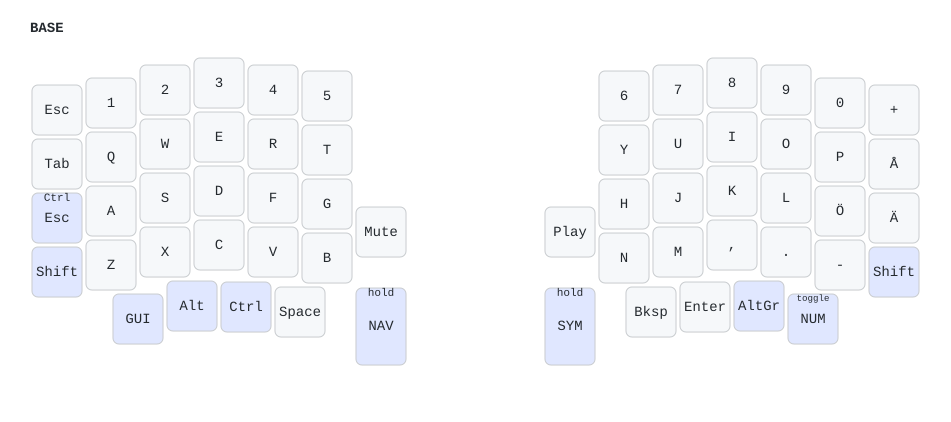
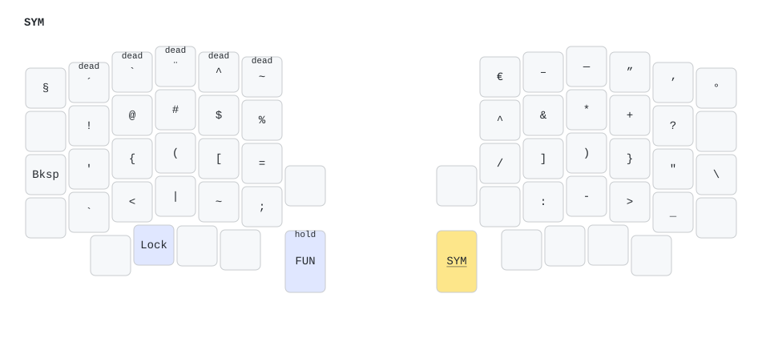
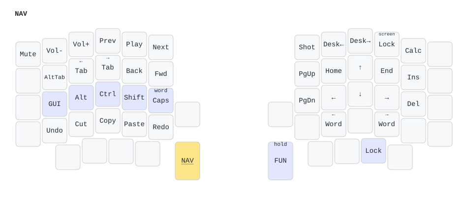
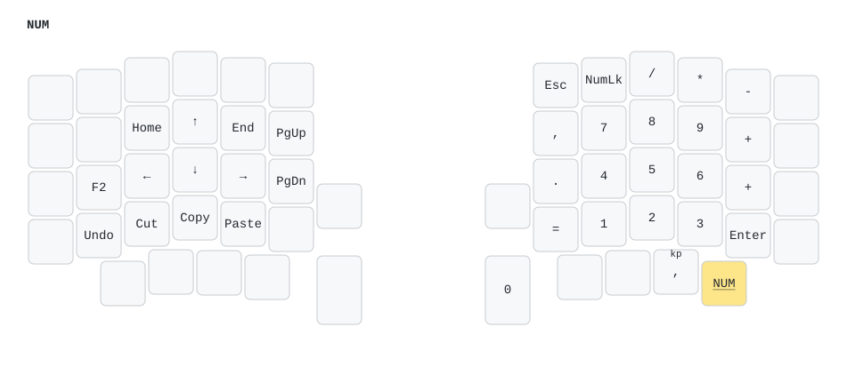
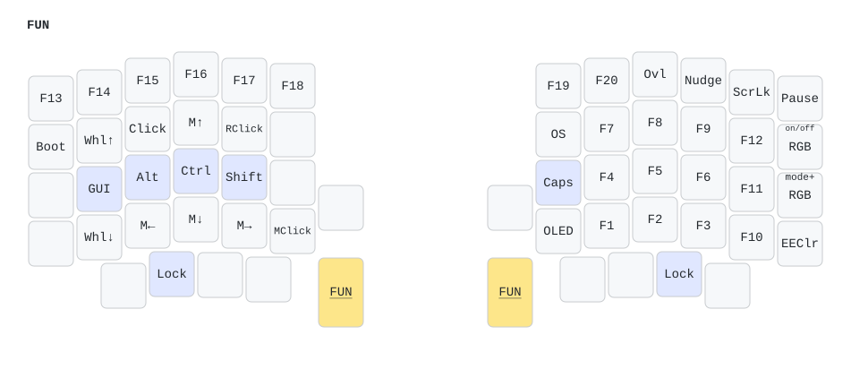
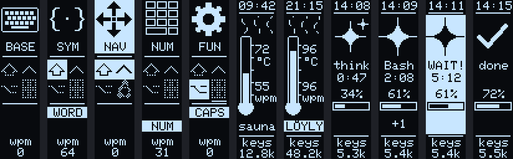
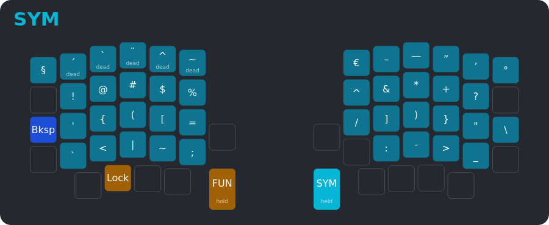

# QMK keyboard configs

Personal QMK keymaps, kept as a [QMK External Userspace](https://docs.qmk.fm/newbs_external_userspace).
Every push builds the firmware in GitHub Actions; the `.uf2` files are attached to the
**latest** release.

- [Sofle Pro: Finnish layout](#sofle-pro-finnish-layout) (main keyboard)
- [PocketType](#pockettype)

## Sofle Pro: Finnish layout

A Mechboards Sofle Pro with an RP2040 controller, per-key RGB, two OLEDs and two encoders.
The keymap is built for a computer set to the **Finnish layout on both Windows and Linux**,
for programming, Finnish writing and numpad work.

Keymap: [`keyboards/mechboards/sofle/pro/keymaps/jaakkolipp`](keyboards/mechboards/sofle/pro/keymaps/jaakkolipp)

### Layers

The images are generated from `keymap.c`, so they always match the firmware.
Yellow keys are held to reach the layer; empty keys fall through to the layer below.

| Layer | How to reach it | What it is for |
|---|---|---|
| **BASE** | default | Finnish QWERTY |
| **SYM** | hold right big thumb | every awkward Finnish character, with no dead keys |
| **NAV** | hold left big thumb | arrows on the right; held modifiers and editing on the left |
| **NUM** | tap the far-right thumb key (toggle) | numpad on the right; spreadsheet keys on the left |
| **FUN** | hold NAV + SYM | F-keys, mouse keys, RGB, system |



**BASE** keeps the normal Finnish QWERTY so laptop muscle memory still works. What changes:
- Backspace moves to the right thumb.
- Esc sits top-left, Tab next to Q.
- The Caps position is Esc when tapped and Ctrl when held.
- Å is back to the right of P.
- Tapping both Shifts turns on **Caps Word**.



**SYM** layout:
- **Brackets are mirrored:** `{ ( [` on the left hand, `] ) }` in the same spots on the right. Every bracket pair (`()`, `({`, `});`, `])`) is typed with alternating hands or different fingers.
- **Top row** follows the US shifted digits (`! @ # $ % ^ & * +`), the order most programming docs assume.
- **`^`, `` ` `` and `~` type the character directly**, with no dead-key Space needed.
- **Row 0** holds the real dead keys for é ü ñ è ê on the left and Finnish typography on the right: `€ – — ” ’ °`. On Linux these use the Finnish layout's own AltGr combinations; on Windows they use Alt+numpad codes.



**NAV** layout:
- **Arrows** form an inverted T. Home/End and PgUp/PgDn sit around them.
- **Left home row = GUI Alt Ctrl Shift** (plain held modifiers, no timing). For example: hold NAV + D + F, then tap → to select a word.
- **Bottom row:** Undo Cut Copy Paste Redo.
- **Top row:** browser tabs, Back/Forward, and a "super Alt-Tab" key that holds Alt while you keep tapping.
- **OS-aware keys:** Redo, screenshot and desktop switching send the right shortcut for the current OS.



**NUM** is a toggle, for longer data entry:
- **Turning NumLock on:** switching the layer on also turns the computer's NumLock on if it was off.
- **Thumbs:** 0 on the big thumb key; the decimal key types `,` (Finnish).
- **Explicit keys:** `,`, `.` and `=` are on the right hand.
- **Left hand:** arrows, Home/End, F2 (edit cell) and Undo/Cut/Copy/Paste.



**FUN** layout:
- **F-keys:** F1–F12 sit where the digits are on NUM (F7 F8 F9 above F4 F5 F6 above F1 F2 F3).
- **Modifiers:** the left home row holds GUI, Alt, Ctrl and Shift, so Alt+F4, Shift+F5 and Ctrl+Shift+F10 work.
- **Also here:**
  - mouse keys
  - RGB controls
  - `Boot` (bootloader) and `EEClr`
  - the **OS** key, which cycles auto / Windows / Linux if detection guesses wrong
  - OLED on/off, overlay pin, and the Claude nudge on/off
- **F21–F23 are left out on purpose:** Linux maps them to touchpad on/off.

**Layer lock:**
- The `Lock` thumb key keeps the current layer on after you let go.
- Press the layer key again to release it; it also turns off after a minute without typing.

**Encoders:**

| Layer | Left knob | Right knob |
|---|---|---|
| BASE | volume (press: mute) | scroll (press: play/pause) |
| NUM | ← → | ↑ ↓ |
| SYM | previous / next tab | zoom − / + |
| NAV | previous / next desktop | undo / redo |
| FUN | RGB mode | RGB brightness |

**Settings in [`config.h`](keyboards/mechboards/sofle/pro/keymaps/jaakkolipp/config.h):**
- On GNOME, uncomment `#define DESKTOP_GNOME` so desktop switching uses Ctrl+Alt+arrow (Windows and KDE use Ctrl+GUI+arrow).
- Caps Word is Finnish-aware:
  - Ö, Ä and Å count as letters.
  - `-` ends the word, so `EU-maa` stays correct.
  - `_` from SYM continues it, for `MAX_VALUE`.
  - `+` is never turned into `?`.

### OLEDs



**Left half: status.**
- **Layer:** an icon and name. The header is inverted while the layer is locked.
- **Modifiers:** Shift, Ctrl, Alt and GUI, drawn solid while held. GUI shows the Windows logo or Tux depending on the detected OS; a line under it means the OS was set by hand.
- **Lock indicators:** `CAPS`, `WORD` (Caps Word) and `NUM`.
- **Typing speed.**

**Right half: fun.**
- **Clock:** sent by the overlay app. Without the app it shows uptime.
- **Sauna-mittari:** a thermometer that heats up with your typing speed (0 wpm = 40 °C, 120 wpm = 110 °C). It steams from 40 wpm and shouts **LÖYLY** at 80+.
- **Claude Code panel:** takes over while a local Claude Code session is working. It shows:
  - `think`, or the running tool (`Bash`, `Edit`, `Read`…)
  - the turn time
  - the context-window fill
  - `+N` for other active sessions

  When Claude is waiting for your permission it blinks **WAIT!** and the underglow breathes amber. The amber glow shows even after the screens have gone to sleep.
- **Keystrokes** this session.

The screens sleep after a minute. To preview OLED changes on a PC without flashing, run `python tools/oled/preview.py`.

### RGB layer guide

On any layer except BASE, only the keys that do something on that layer light up, coloured by what they do:

| Colour | Keys |
|---|---|
| cyan | symbols |
| white | digits and F-keys |
| green | navigation |
| blue | editing |
| orange | modifiers |
| yellow | layer keys |
| purple | system |
| red | `Boot` / `EEClr` |

The underglow takes the layer colour. Caps Lock and Caps Word light the Shift keys red. RGB turns off after five minutes idle.

### On-screen layer overlay

[`tools/layer_overlay`](tools/layer_overlay) is a small Windows/Linux app. When you hold a layer key for 200 ms, a picture of that layer appears at the bottom of the screen. The picture is click-through and never takes focus.



- **Locked layers** stay on screen. NUM shows a small corner badge instead.
- **Tray icon:** shows the layer colour. Click it, or press the FUN `Ovl` key, for a cheat sheet of every layer.
- **Live keymap:** the app reads the keymap from the keyboard over VIA, so remaps made in VIA show up too.
- **Clock and Claude status:** the app sends the time and the Claude Code status to the keyboard.

Install it once (needs Python 3.10+):

```sh
pip install ./tools/layer_overlay
python -m layer_overlay --install-autostart   # start at login
python -m layer_overlay                       # run now
```

- **Linux:**
  - **Permissions:** allow your user to open the keyboard:
    ```sh
    sudo cp tools/layer_overlay/linux/50-sofle-overlay.rules /etc/udev/rules.d/
    sudo udevadm control --reload-rules && sudo udevadm trigger
    ```
  - **Wayland:** the app runs itself through XWayland so it can stay on top (works on GNOME and KDE).
- **Windows:** nothing extra is needed. `--install-autostart` adds a login entry that starts without a console window.
- **Other options:**
  - `--sheet` opens the cheat sheet.
  - `--demo DIR` renders every layer to PNG.
  - `--state` prints what the keyboard reports.

#### Claude Code status on the keyboard

This works with Claude Code running on the same computer (CLI, IDE or desktop app).

```sh
python tools/claude_status/install.py --statusline
```

**What the installer does:**
- It adds async hooks to `~/.claude/settings.json` and keeps your existing settings. The file is backed up first.
- `--statusline` also adds the context-window bar, unless you already have a status line.
- `--uninstall` removes everything it added.

**What the hooks do:**
- They send only the event name, a hashed session id, the tool name and the notification type to the overlay app, over `127.0.0.1`.
- They never send prompts, file contents or command text.
- They print nothing and always succeed, so they can't affect Claude.

### Building and flashing

1. Download `mechboards_sofle_pro_jaakkolipp.uf2` from the latest release, or build it yourself (below).
2. Put one half into its bootloader. Any of these works:
   - double-tap the reset button
   - hold the top-left key (left half) or top-right key (right half) while plugging in USB
   - press `Boot` on FUN
3. Copy the `.uf2` to the `RPI-RP2` drive that appears.
4. Repeat for the other half.
5. Plug USB into the **left** half.

Build locally:

```sh
qmk config user.overlay_dir="$(realpath .)"
qmk compile -kb mechboards/sofle/pro -km jaakkolipp
```

**VIA:** VIA still works for quick experiments. A new firmware build resets VIA's stored keymap to `keymap.c`, so `keymap.c` stays the source of truth.

### Changing things

| To change… | Edit | Then |
|---|---|---|
| keys | `keymap.c` | push; CI rebuilds the firmware and redraws `docs/layers` and the overlay data. To regenerate locally: `python tools/keymap/gen_layers.py --draw` |
| OLED graphics | `tools/oled/gen_gfx.py` | run `python tools/oled/gen_gfx.py` |
| OLED layout | `features/oled.c` | check with `python tools/oled/preview.py` |

**Repo layout:**

```
keyboards/mechboards/sofle/pro/keymaps/jaakkolipp/   keymap, config, features/*.c
modules/jaakkolipp/no_mechboards_oled/              drops the stock Mechboards OLED code
tools/keymap/        layer data + images generator
tools/oled/          OLED bitmap generator and PC preview
tools/layer_overlay/ overlay app and Claude Code hooks
tools/claude_status/ hook installer
docs/                generated images
archive/             previous Sofle keymaps
```

## PocketType

A small pocket-sized keyboard, aiming for few compromises despite its size and key count.
Config files are in [`keyboards/pockettype`](keyboards/pockettype).
